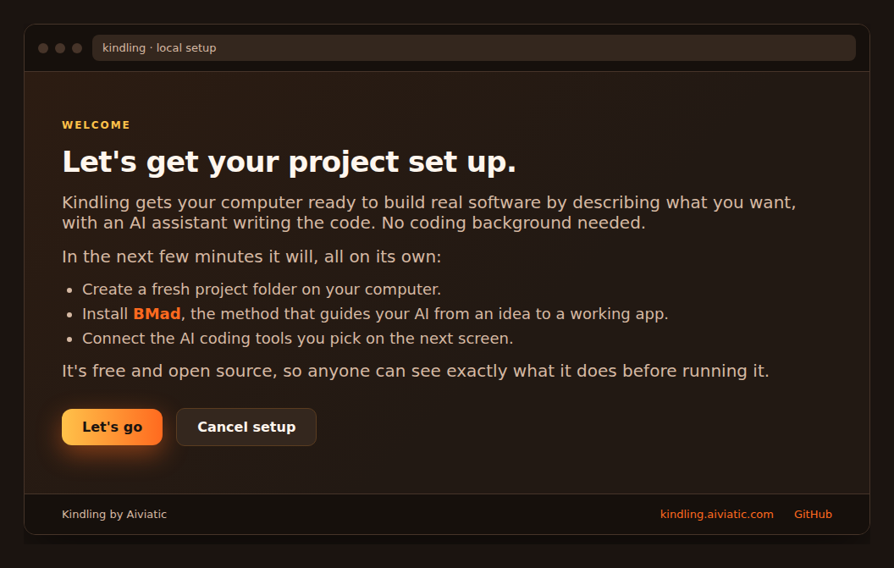
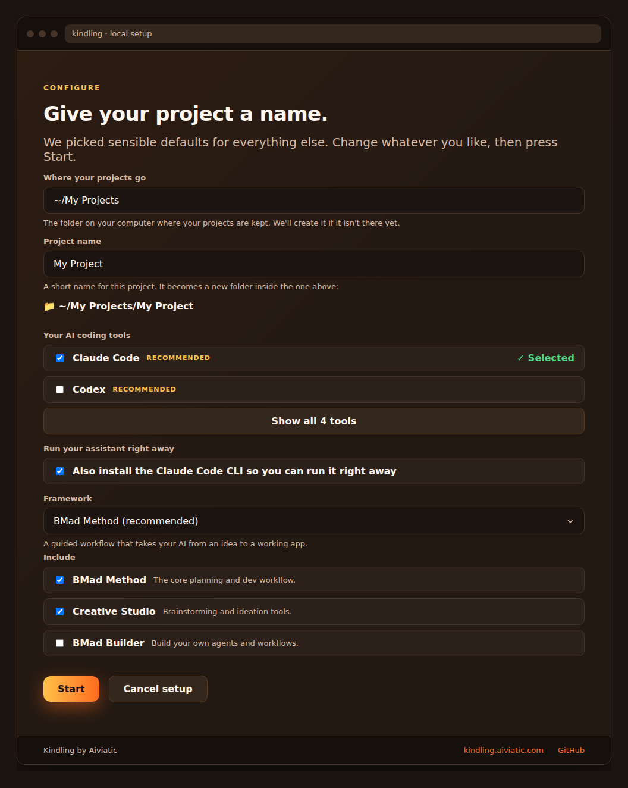
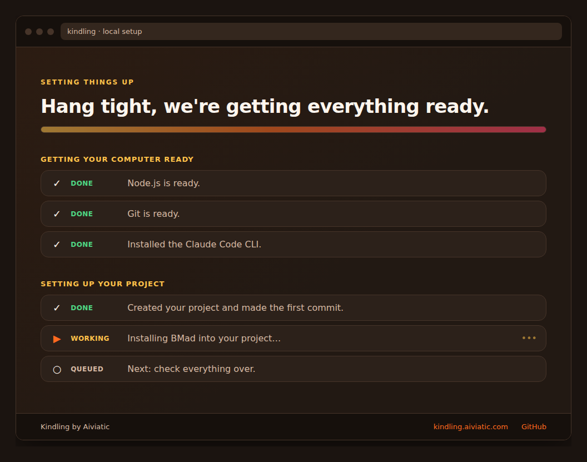
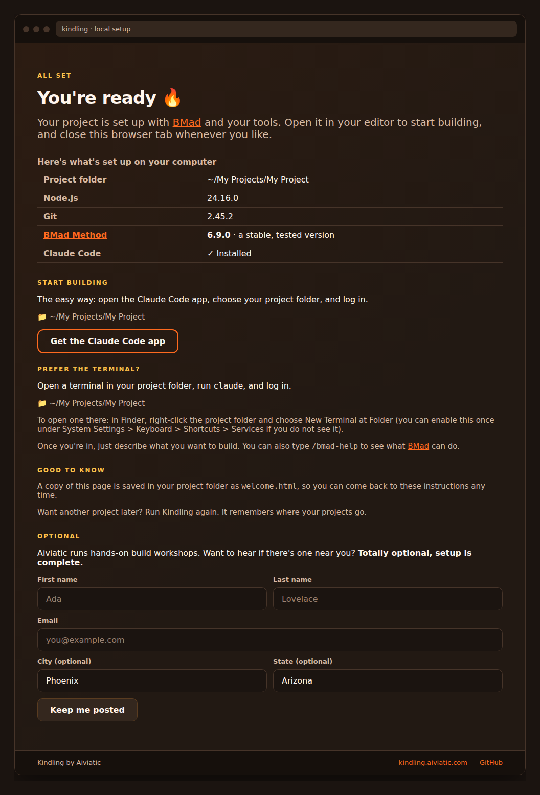

# Kindling

**Blank computer to building in about five minutes, no terminal knowledge required.**

Kindling is a cross-platform installer that gets a non-technical person from a
fresh computer (Mac, Windows, or Linux) to a ready-to-build project for AI-driven
app development, scaffolded with [BMad](https://github.com/bmad-code-org/BMAD-METHOD)
by default (or no framework, if you'd rather bring your own). You run one step, make
a few choices in your browser, and Kindling installs and wires everything up for you.

It's open source on purpose: the very first thing Kindling does is run a script on
your machine, so you should be able to read exactly what that script does. See
[SECURITY.md](SECURITY.md) for the security model.

## What it looks like

Everything happens in your browser, in plain language. Here's the whole journey:

**1. A quick intro to what's about to happen.**



**2. Name your project and pick your tools (sensible defaults are pre-filled).**



**3. Honest, never-frozen progress while it works.**



**4. A friendly summary of what got set up, and how to start building.**



## How it works

Three layers, so the scary parts happen where they can be explained:

1. **A per-OS bootstrap script** (`bootstrap/`) gets the prerequisites in place.
   It provisions a pinned Node.js (via `nvm` on macOS/Linux; on Windows it downloads
   a pinned, SHA-256-verified portable Node, or reuses an existing Node 20+). On
   Windows it also provisions a pinned, SHA-256-verified portable Git (MinGit) if
   Git is missing. It then launches Kindling in the same shell.
   - macOS/Linux: `curl -fsSL https://kindling.aiviatic.com/install | bash`
   - Windows: download `kindling.cmd` and double-click it (it fetches and runs
     `setup.ps1` over HTTPS).
2. **A temporary localhost server** (`server/`) stands up on `127.0.0.1`, serves a
   friendly browser UI, provisions Git where the bootstrap hasn't already, scaffolds
   the project, runs `npx bmad-method install`, and installs any agent CLIs you opt
   into. It exits when the install completes.
3. **A browser UI** (`ui/`) walks you through the few choices (project folder and
   name, tools, and framework) and shows honest progress, grouped into system setup
   and project setup, including the ~5-minute macOS developer-tools dialog, so it
   never looks frozen.

The installer is published to npm as **`@aiviatic/kindling`**; the bootstrap's
final step is `npx @aiviatic/kindling@<pinned-version>`.

> This repo is the **installer** (what runs on your machine). The marketing/landing
> site and its serverless bits are maintained separately.

## Try it

If you already have Node 20+, you can run the installer directly:

```bash
npx @aiviatic/kindling
```

Otherwise, get the one-step command for your OS at
**<https://kindling.aiviatic.com/install>**.

## Development

```bash
git clone https://github.com/Aiviatic/kindling.git
cd kindling
nvm use && npm install
npm test        # unit suite (Vitest)
npm run build   # tsup (Node payload) + Vite (browser UI)
```

- **TypeScript + ESM** throughout; dev/build on the Node in `.nvmrc`, runtime floor **Node 20+**.
- **React + Vite** for the browser UI; **tsup** bundles the Node side (`engine/`, `server/`, `cli/`).
- **Vitest** for tests (co-located `*.test.ts(x)`); CI runs typecheck + lint + test + build on
  macOS, Windows, and Ubuntu, on Node 20 and 24.

Layout: `engine/` (headless install logic), `server/` (localhost server + Welcome
page), `ui/` (React install UI), `cli/` + `bin/` (the `npx` entry), `bootstrap/`
(per-OS entry scripts), `scripts/` (dev helpers).

See [CONTRIBUTING.md](CONTRIBUTING.md) to get started. Windows fixes are especially welcome.

## License

[MIT](LICENSE) © Aiviatic
